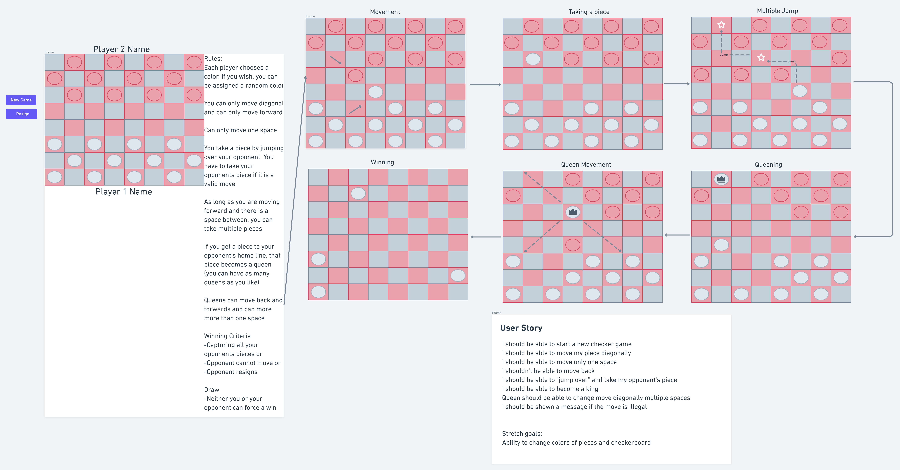

# Projects
Checkers!

Rules: 
Each player chooses a color. If you wish, you can be assigned a random color (coming soon)

You can only move diagonal and can only move forward

Can only move one space

You take a piece by jumping over your opponent. You have to take your opponents piece if it is a valid move

As long as you are moving forward and there is a space between, you can take multiple pieces

If you get a piece to your opponent's home line, that piece becomes a king (you can have as many kings as you like)

kings can move back and forwards and can move more than one space

Winning Criteria
-Capturing all your opponents pieces or
-Opponent cannot move 

User Story
I should be able to start a new checker game
I should be able to move my piece diagonally
I should be able to move only one space
I shouldn't be able to move back
I should be able to "jump over" and take my opponent's piece
I should be able to become a king
Queen should be able to change move diagonally multiple spaces
I should be shown a message if the move is illegal

Stretch goals:
Ability to change colors of pieces and checkerboard
